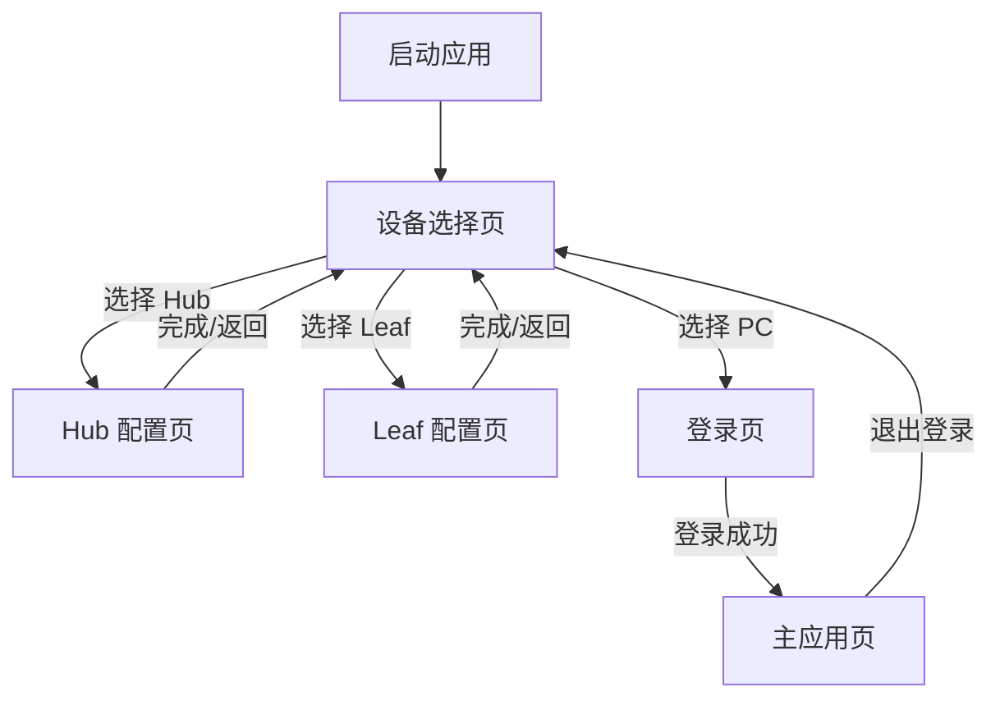
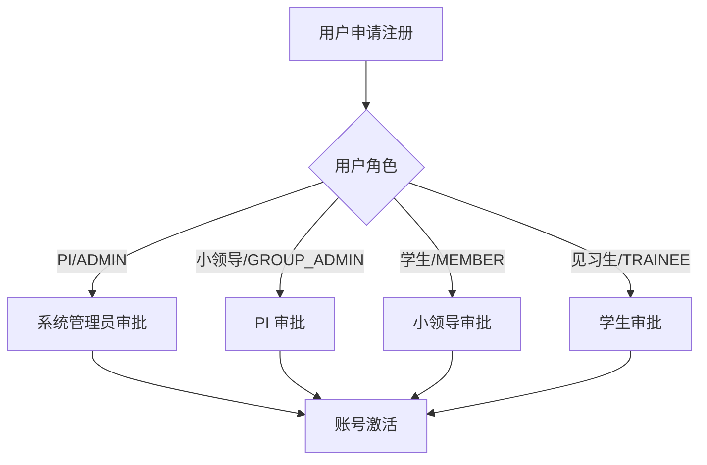
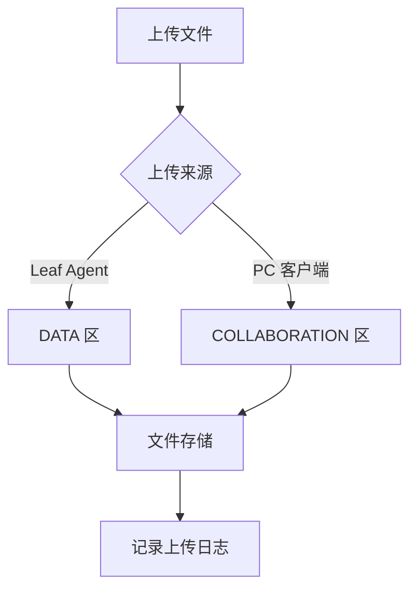
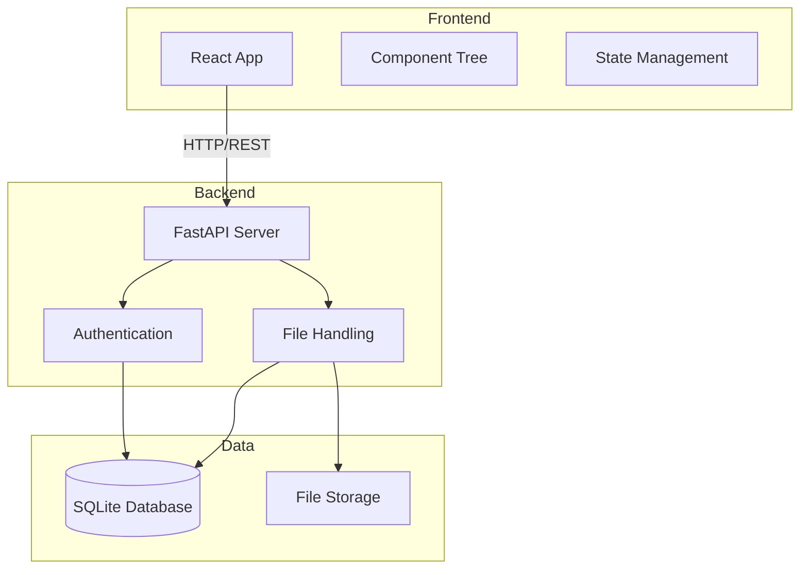
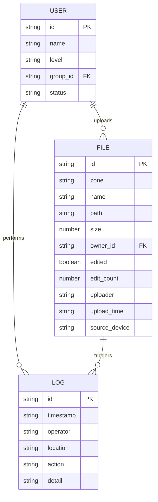

# LabVault 前端产品需求文档 (PRD)

## 1. Product Overview

LabVault 是一个实验室数据存储与管理系统，旨在解决实验数据的安全存储、追溯和协作问题。
- 目标用户：实验室 PI（负责人）、小领导、学生、见习生
- 核心价值：确保实验数据不可篡改，提供编辑追溯功能，支持多角色权限管理

## 2. Core Features

### 2.1 User Roles

| Role | Registration Method | Core Permissions |
|------|---------------------|------------------|
| ADMIN (PI) | 由系统管理员创建 | 全系统管理权限，用户管理，文件管理 |
| GROUP_ADMIN (小领导) | 由 PI 批准 | 组内文件管理，成员管理 |
| MEMBER (学生) | 由小领导批准 | 上传协作文件，下载数据 |
| TRAINEE (见习生) | 由学生批准 | 只读访问 |

### 2.2 Feature Module

1. **设备选择页**：选择设备类型（Hub/Leaf/PC）
2. **登录页**：用户身份认证
3. **主应用页**：
   - 我的数据（DATA 区）
   - 协作区（COLLABORATION 区）
   - 已编辑文件（Suspect Zone）
   - 操作日志
4. **Hub 配置页**：中央服务器配置
5. **Leaf 配置页**：实验室设备配置

### 2.3 Page Details

| Page Name | Module Name | Feature description |
|-----------|-------------|---------------------|
| 设备选择页 | 设备选择 | 提供三种设备类型卡片，用户选择后进入对应流程 |
| 登录页 | 用户登录 | 用户名密码登录，记住登录状态 |
| 主应用页 | 我的数据 | 查看 Leaf Agent 上传的实验数据（只读） |
| 主应用页 | 协作区 | 上传、下载、删除协作文件 |
| 主应用页 | 已编辑文件 | 查看所有被编辑过的文件，显示编辑次数 |
| 主应用页 | 操作日志 | 查看系统操作记录 |
| Hub 配置页 | Hub 配置 | 配置中央服务器参数 |
| Leaf 配置页 | Leaf 配置 | 配置实验室设备参数，申请接入权限 |

## 3. Core Process

### 3.1 设备选择流程



### 3.2 用户注册流程



### 3.3 文件上传流程



## 4. User Interface Design

### 4.1 Design Style

- **主色调**：科技蓝 (#3498db)、安全绿 (#27ae60)、警告红 (#e74c3c)
- **按钮风格**：圆角矩形，悬停有阴影效果
- **字体**：系统默认无衬线字体，标题 18-24px，正文 14-16px
- **布局风格**：卡片式布局，左侧导航栏 + 右侧内容区
- **图标风格**：Emoji 图标，简洁直观

### 4.2 Page Design Overview

| Page Name | Module Name | UI Elements |
|-----------|-------------|-------------|
| 设备选择页 | 设备卡片 | 三种设备卡片，PC 卡片最大最醒目，Hub 和 Leaf 在上方 |
| 登录页 | 登录表单 | 居中卡片，用户名/密码输入框，登录按钮 |
| 主应用页 | 侧边栏 | 垂直导航，包含：我的数据、已编辑文件、协作区、日志 |
| 主应用页 | 文件列表 | 卡片式文件项，显示文件名、大小、上传时间、来源设备 |
| 主应用页 | 已编辑文件 | 表格展示，突出显示编辑次数，黄色背景警告 |
| 主应用页 | 上传区域 | 拖拽上传区，支持点击选择文件 |

### 4.3 Responsiveness

- 桌面端优先设计
- 支持窗口缩放
- 移动端简化侧边栏为抽屉式

---

# LabVault 技术架构文档

## 1. Architecture Design



## 2. Technology Description

- **Frontend**: React@18 + TypeScript + Vite
- **Backend**: FastAPI (Python)
- **Database**: SQLite
- **Packaging**: Electron (PC 客户端) + PyInstaller (Hub/Leaf)
- **State Management**: React Hooks (useState, useEffect)
- **HTTP Client**: Axios

## 3. Route Definitions

| Route (Internal State) | Purpose |
|-------------------------|---------|
| device-select | 设备选择页面 |
| login | 用户登录页面 |
| main/data | 我的数据页面 |
| main/collab | 协作区页面 |
| main/edited | 已编辑文件页面 |
| main/logs | 操作日志页面 |
| config/hub | Hub 配置页面 |
| config/leaf | Leaf 配置页面 |

## 4. API Definitions

### 4.1 认证接口

```typescript
// 登录
POST /api/token
Request: FormData { username, password }
Response: { access_token: string, token_type: string }

// 获取当前用户
GET /api/users/me
Response: {
  id: string,
  name: string,
  level: 'ADMIN' | 'GROUP_ADMIN' | 'MEMBER' | 'TRAINEE',
  group_id?: string,
  status: string
}
```

### 4.2 文件接口

```typescript
// 获取文件列表
GET /api/files?zone=DATA|COLLABORATION&edited_only=true|false
Response: Array<{
  id: string,
  zone: string,
  name: string,
  path: string,
  size: number,
  owner_id: string,
  edited: boolean,
  edit_count: number,
  uploader: string,
  upload_time: string,
  source_device: string
}>

// 上传文件
POST /api/files/upload
Request: FormData { file, zone, path, source_device }
Response: { id: string, message: string }

// 下载文件
GET /api/files/{file_id}
Response: Blob

// 删除文件
DELETE /api/files/{file_id}
Response: { message: string }
```

### 4.3 日志接口

```typescript
// 获取操作日志
GET /api/logs
Response: Array<{
  id: string,
  timestamp: string,
  operator: string,
  location: string,
  action: string,
  detail: string
}>
```

## 5. Data Model

### 5.1 ER Diagram


